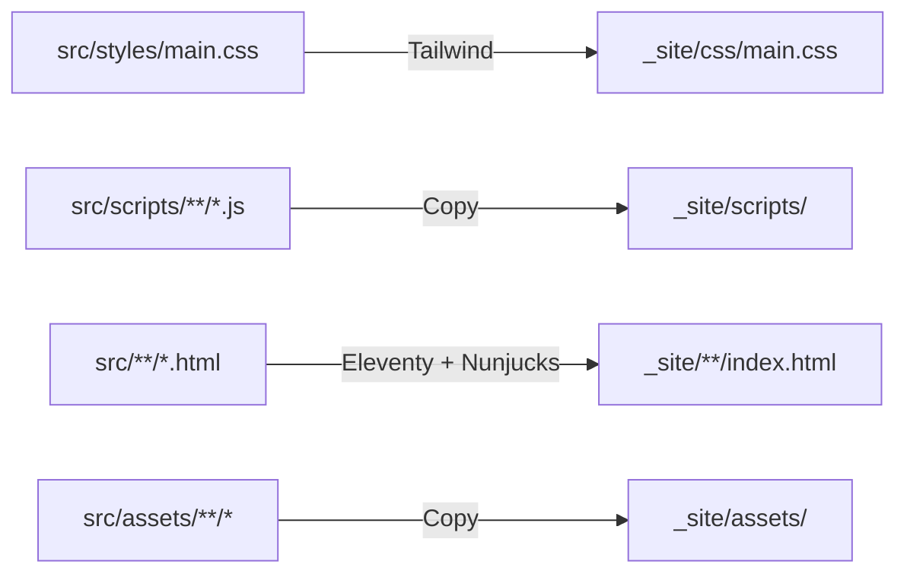

# Refactoring Tag v1.0.0-refactored

## 🏗️ Architettura del Progetto

### Stack Tecnologico

**Generatore di Siti Statici:**
- **Eleventy (11ty) v3.1.2** - Static Site Generator
  - Template engine: Nunjucks (.njk)
  - Markdown support con markdown-it
  - Build automatico e hot reload

**CSS Framework:**
- **Tailwind CSS v3.4.19** - Utility-first CSS framework
  - Build locale (no CDN)
  - PurgeCSS automatico
  - PostCSS v8.5.6 per processing
  - Autoprefixer v10.4.24 per compatibilità browser

**JavaScript:**
- ES6 Modules nativi (type="module")
- Lucide Icons - Icon library
- Nessun framework frontend (vanilla JS)

**Build Tools:**
- npm-run-all v4.1.5 - Parallel task execution
- Node.js (dev environment)

### Struttura Directory

```
transpersonaltraining/
├── src/                          # Codice sorgente (input Eleventy)
│   ├── _includes/               # Template Nunjucks
│   │   ├── base.njk            # Layout principale
│   │   ├── navigation.njk      # Navbar globale
│   │   └── footer.njk          # Footer globale
│   │
│   ├── _data/                  # Dati strutturati
│   │   ├── coreTeachers.json   # Lista docenti core
│   │   ├── guestTeachers.json  # Lista docenti ospiti
│   │   └── bios/*.md           # Biografie in Markdown
│   │
│   ├── styles/                 # CSS modulare
│   │   ├── base.css            # Reset e base styles
│   │   ├── theme.css           # Variabili temi colore
│   │   ├── main.css            # Entry point (con @tailwind)
│   │   └── components/
│   │       └── navigation.css  # Stili navbar/dropdown
│   │
│   ├── scripts/                # JavaScript modulare
│   │   ├── main.js            # Entry point
│   │   ├── modules/           # Moduli core riutilizzabili
│   │   │   ├── icons.js       # Gestione Lucide icons
│   │   │   ├── navigation.js  # Menu mobile, scroll navbar
│   │   │   └── theme-switcher.js # Sistema temi
│   │   └── pages/             # Script specifici per pagina
│   │       ├── schedule.js    # Google Sheets integration
│   │       └── training.js    # Animazione vine
│   │
│   ├── assets/                # Media files
│   │   ├── images/           # Immagini (vineyard.jpg)
│   │   └── videos/           # Video (forest-stream.mp4)
│   │
│   └── *.html                 # Pagine Eleventy con front matter
│       ├── index.html         # Homepage
│       ├── training.html      # Training programs
│       ├── techniques.html    # Tecniche terapeutiche
│       ├── transpersonal_therapy.html
│       └── schedule.html      # Calendario eventi
│
├── _site/                     # Build output (generato, in .gitignore)
│   ├── css/main.css          # CSS compilato e minificato (23KB)
│   ├── scripts/              # JS copiati
│   ├── assets/               # Media copiati
│   └── */index.html          # Pagine generate
│
├── TESTS/                     # File test e documentazione setup
│   ├── teachers_testB.html   # Varianti test
│   ├── hero_journey.html     # Pagine sperimentali
│   └── *.md                  # Doc setup Google Apps Script
│
├── Configuration Files
│   ├── .eleventy.js          # Config Eleventy
│   ├── tailwind.config.js    # Config Tailwind
│   ├── postcss.config.js     # Config PostCSS
│   ├── package.json          # Dependencies e scripts
│   └── .gitignore            # Esclude _site/ e node_modules/
│
└── Legacy Files (compatibilità temporanea)
    ├── teachers.html         # Da migrare a Eleventy
    ├── style.css             # CSS per teachers.html legacy
    └── schedule-app.js       # Usato da schedule page
```

### Flusso di Build



**Comandi npm:**
```bash
npm run dev        # Build CSS + Eleventy in watch mode (parallelo)
npm run build      # Build completo (clean + CSS + Eleventy)
npm run serve      # Alias per dev
```

### Sistema di Temi

**7 temi colore dinamici:**
- `default` - School Lavender (viola chiaro)
- `iris` - Deep Iris (viola scuro)
- `blue` - Scientific Blue
- `ocean` - Ocean Depth (teal)
- `forest` - Deep Forest (verde)
- `earth` - Burnt Earth (terracotta)
- `alchemy` - Alchemy (magenta)

**Implementazione:**
- CSS Variables per colori dinamici
- LocalStorage per persistenza preferenza
- Theme switcher button fixed bottom-right
- JS module dedicato in `src/scripts/modules/theme-switcher.js`

### Integrazioni Esterne

**Google Sheets API:**
- File: `schedule-app.js` (449 righe)
- Funzione: Caricamento dinamico calendario/appuntamenti
- Doc setup: `TESTS/GOOGLE_APPS_SCRIPT_SETUP.md`

**CDN Dependencies:**
- Google Fonts (Inter, Merriweather)
- Lucide Icons (unpkg.com)
- Unsplash (immagini hero placeholder)

---

## Come visualizzare il tag

### Mostrare il messaggio completo del tag
```bash
git show v1.0.0-refactored
```

### Vedere solo il messaggio del tag (senza diff)
```bash
git tag -l -n100 v1.0.0-refactored
```

### Elencare tutti i tag
```bash
git tag -l
```

### Vedere i commit dal tag a ora
```bash
git log v1.0.0-refactored..HEAD --oneline
```

## Come usare il tag

### Tornare a questo punto del progetto
```bash
git checkout v1.0.0-refactored
```

### Creare un branch da questo tag
```bash
git checkout -b nuova-feature v1.0.0-refactored
```

### Pushare il tag al repository remoto
```bash
git push origin v1.0.0-refactored
```

### Eliminare il tag (se necessario)
```bash
# Locale
git tag -d v1.0.0-refactored

# Remoto
git push origin --delete v1.0.0-refactored
```

## Riepilogo del Refactoring

Questo tag marca il completamento delle Fasi 1-5 del refactoring:

- **Fase 1**: Rimossi file HTML duplicati (~14,939 righe)
- **Fase 2**: CSS organizzato + Tailwind locale (3.5MB → 23KB)
- **Fase 3**: JavaScript modularizzato (ES6 modules)
- **Fase 4**: Assets organizzati in src/assets/
- **Fase 5**: Puliti file legacy e duplicati

**Risultato**: Progetto pulito, modulare e performante ✅

---

## 📚 Librerie e Dipendenze

### Production Dependencies

```json
"dependencies": {
  "markdown-it": "^14.1.0"  // Markdown parser per biografie
}
```

### Development Dependencies

```json
"devDependencies": {
  "@11ty/eleventy": "^3.1.2",      // Static site generator
  "tailwindcss": "^3.4.19",        // CSS framework
  "postcss": "^8.5.6",             // CSS processor
  "autoprefixer": "^10.4.24",      // Vendor prefixes automatici
  "npm-run-all": "^4.1.5"          // Parallel npm scripts
}
```

### CDN Dependencies (Browser)

```html
<!-- Fonts -->
<link href="https://fonts.googleapis.com/css2?family=Inter:wght@300;400;500;600&family=Merriweather:ital,wght@0,300;0,400;0,700;1,400&display=swap">

<!-- Icons -->
<script src="https://unpkg.com/lucide@latest"></script>
```

**Note:**
- ⚠️ Lucide usa `@latest` - considerare versione fissa
- ✅ Google Fonts ha versioni specificate nei weights

---

## 🚀 TODO - Prossimi Passi

### Priorità ALTA (subito)

#### 1. Migrare teachers.html a Eleventy
**Problema:** teachers.html (1,445 righe) è l'unico file HTML legacy nella root
**Soluzione:**
```bash
# 1. Creare src/teachers.html con front matter
# 2. Estrarre contenuto unico
# 3. Usare layout: base.njk
# 4. Testare funzionalità toggle bio
# 5. Eliminare teachers.html dalla root
# 6. Eliminare style.css (non più necessario)
```
**Impatto:** Completare migrazione a 100% Eleventy, eliminare duplicazione CSS

#### 2. Risolvere Duplicazione style.css
**Problema:** `style.css` nella root duplica `src/styles/*`
**Opzioni:**
- A) Eliminare dopo migrazione teachers.html ✅ (consigliata)
- B) Hook Eleventy per sync automatico
- C) Symlink (sconsigliato, problemi con _site/ clean)

**Attuale:** Mantenuto temporaneamente per compatibilità teachers.html

#### 3. Fissare Versioni CDN
**Problema:** Lucide usa `@latest` = breaking changes imprevedibili
**Soluzione:**
```html
<!-- Da: -->
<script src="https://unpkg.com/lucide@latest"></script>

<!-- A: -->
<script src="https://unpkg.com/lucide@0.294.0"></script>
```

### Priorità MEDIA (prossime settimane)

#### 4. Ottimizzazione Assets
**Video:** forest-stream.mp4 (3.3MB)
```bash
# Comprimere con ffmpeg
ffmpeg -i forest-stream.mp4 -vcodec libx264 -crf 28 forest-stream-compressed.mp4

# Creare versioni responsive
# Implementare lazy loading
```

**Immagini:**
- Implementare @11ty/eleventy-img per ottimizzazione automatica
- Generare srcset per responsive images
- Aggiungere webp/avif fallback

#### 5. Migrare File in TESTS/
**File da convertire o eliminare:**
- `TESTS/hero_journey.html` (48KB) - Decidere se integrare o eliminare
- `TESTS/client_model.html` (18KB) - Modello utile? Documentare o rimuovere
- `TESTS/transpersonal_therapist.html` (21KB) - Integrare come pagina?
- `TESTS/teachers_testB/C.html` - Eliminare se non più necessari

#### 6. Setup Linting e Formatting
```bash
# ESLint per JavaScript
npm install -D eslint eslint-config-standard

# Prettier per code formatting
npm install -D prettier

# Husky + lint-staged per pre-commit
npm install -D husky lint-staged
npx husky install
```

**Script da aggiungere a package.json:**
```json
"scripts": {
  "lint": "eslint src/scripts/**/*.js",
  "format": "prettier --write \"src/**/*.{html,css,js,njk,md}\"",
  "lint:fix": "eslint --fix src/scripts/**/*.js"
}
```

### Priorità BASSA (future enhancements)

#### 7. Performance Optimization
- [ ] Critical CSS inline per first paint
- [ ] JS code splitting (bundle per pagina)
- [ ] Service Worker per PWA
- [ ] Preload/prefetch risorse critiche
- [ ] Image lazy loading nativo

#### 8. Build Pipeline Advanced
- [ ] Minificazione JS con esbuild/terser
- [ ] Source maps per debugging
- [ ] Bundle analyzer
- [ ] Lighthouse CI per monitoring performance

#### 9. Testing
- [ ] Unit tests per moduli JS (Jest)
- [ ] E2E tests (Playwright/Cypress)
- [ ] Visual regression testing
- [ ] Accessibility testing (axe)

#### 10. SEO & Accessibility
- [ ] Generare sitemap.xml automaticamente
- [ ] Implementare structured data (JSON-LD)
- [ ] Aggiungere meta tags OpenGraph/Twitter
- [ ] Audit accessibility completo
- [ ] Implementare skip links

#### 11. Documentazione
- [ ] JSDoc per funzioni JavaScript
- [ ] Style guide per componenti
- [ ] ARCHITECTURE.md dettagliato
- [ ] CONTRIBUTING.md per contributor

#### 12. CI/CD
- [ ] GitHub Actions per build automatico
- [ ] Deploy automatico su push a main
- [ ] Preview deployments per PR
- [ ] Test automatici su PR

---

## ⚠️ Known Issues

### 1. Style.css Duplicato
**Descrizione:** style.css nella root duplica src/styles/*  
**Motivo:** Compatibilità con teachers.html legacy  
**Fix:** Da risolvere con migrazione teachers.html

### 2. Browserslist Outdated
**Warning durante build:**
```
Browserslist: caniuse-lite is outdated
```
**Fix:**
```bash
npx update-browserslist-db@latest
```

### 3. CDN Lucide @latest
**Rischio:** Breaking changes non controllati  
**Fix:** Specificare versione fissa (vedi TODO #3)

### 4. File Legacy JS nella Root
**File:** schedule-app.js (449 righe)  
**Motivo:** Usato da schedule page tramite tag script  
**Fix:** Migrazione a Eleventy data file in corso (vedi SCHEDULE_MIGRATION_PLAN.md)

---

## 📊 Metriche Performance

### Build Time
- **CSS Build:** ~420ms (Tailwind + PostCSS)
- **Eleventy Build:** ~180ms (6 pagine)
- **Total:** ~600ms

### Bundle Sizes
- **CSS:** 23KB minificato (vs 3.5MB CDN = 99.3% riduzione)
- **JS main.js:** ~700 bytes
- **JS modules totale:** ~4KB
- **JS pages (schedule):** 17KB
- **JS pages (training):** 10KB

### Lighthouse Scores (Target)
- Performance: >90
- Accessibility: >95
- Best Practices: >90
- SEO: >95

---

## 🔗 Risorse Utili

- [Eleventy Documentation](https://www.11ty.dev/docs/)
- [Tailwind CSS Documentation](https://tailwindcss.com/docs)
- [Lucide Icons](https://lucide.dev/)
- [Nunjucks Template Language](https://mozilla.github.io/nunjucks/)
- [Markdown-it](https://markdown-it.github.io/)
